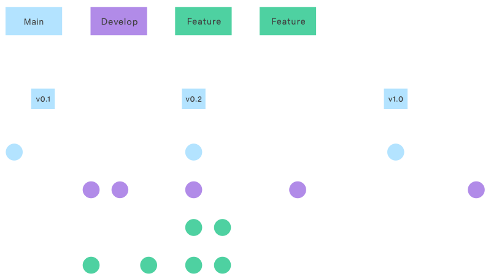

# Undefined Manifesto

 

 

# 💖 Our values

1. **Foster an atmosphere of psychological safety.** No stupid questions/ideas.
2. **Communicate with each other even when it's uncomfortable.** When we’re doing something we do it together and communicate what we are doing and when.
3. **Be inclusive and respectful** of each other’s beliefs and points of view.
4. **Shared Ownership**- we all own the product.
5. **We remember that we are all working towards the same goal**; despite our differences on how to get there, it’s us against the problem not us against each other.

 

# 😵‍💫 In case of indecisiveness/conflict break glass

**Step 1**: Talk about the problem for a set amount of time. Use a timer.

- if it's a conflict, make sure all sides of the conflict have equal amount time to speak
- Aim to establish a compormise

**Step 2**: Dot voting. 

_Remember to conduct discussions in a calm manner. if the conflict gwets heated, go back to the values part of manifesto_

 

# 🪘 Rhythm of the day

**09:00** | Stand-up:

- Group discussion: tickets' priorities, pairing for the day;
- Individual: Which ticket will you work on for today?
- Individual: What may you struggle with today and how would you tackle that ? (pre-mortem)
- Individual: What would success look like to you today? _Write this down on the ticket and use as a criteria for ticking it off._

**11:00** | Break (30min)

**12:30** | Lunch (1h)

**13:30** | Catch-up meeting

**14:30** | Break (30min)

**16:45** | Retrospective. What have you:

- Liked?
- Learned?
- Lacked?
- Longed for?

 

_**Out of hours**: No expectation to work after hours | All after-hours work needs to be approved by the team beforehand (team mates need to be invited to join) | No guarantee after-hours changes will be deployed -> subject to team approval_

# 🌊 GitHub: Feature Branch Flow

We have 3 kinds of branches:

- **Main**: stores our release history
- **Develop**: our current working copy
- **Feature**: Multiple smaller branches used for work on individual features/tickets.

 

## The Flow

1. **Create a new feature branch** off Develop.❗No one works on Develop or Main❗
2. **Make changes**:
   - Add comments as you go
   - Plan inside [Dev Log](./Dev_log.md) and tick things off as you go.
   - Important things (variable names, shape of data etc.) also to be put in [Dev Log](./Dev_log.md)'s Standards section
3. **Add-Commit-Push**
   - Commit names to be descriptive: sentences, not words.
   - Atomic commits: Each commit contains an isolated, complete change.
4. **Pull request**
   - Leave a descriptive comment on what you've changed (can include imqges, links and tables)
5. **Review - Deploy - Merge**
   - Done as a group
   - Merge to Develop, not Main.
6. **Delete branch**
   - Both on gitHub and locally

 

👉[Phoebe's master guide to GitHub](https://docs.google.com/document/d/1VifQDxUm9TVDRkqp9MZDh9r6rHuaBmK22ObcDI2DICo/edit?usp=sharing)

👉[More info about GitHub Flow](https://www.w3schools.com/git/git_github_flow.asp)

 

# ✅ Checklists

## Start of day

1. **Check** you are working on a branch (not on main)
2. **Log** an entry in the [Dev Log](./Dev_log.md) with the date, your names, ticket name and your plan to tckle the ticket

## End of day

1. **Check** you are still on branch.
2. **Commit & Push** your changes.
3. **Tick off** tasks in your entry in [Dev Log](./Dev_log.md)

 

# 💎 Nadeem's wisdom nuggets

1. Have a working frontend before you start coding the backend (use mock back-end)
2. You're demoing the product, not the code. The code is **a** way of achieving the product.
3. Disagree and commit: If you disagree with direction the project is going, **you speak up.** Conversely, if we agree to go a certain direction, **you commit** and do your best to take the project in that direction.
4. Demonstrate your capacity to learn- the point is for everyone to dip toes in every aspect of the project and not to pigeonhole ourselves.
5. Pritoritize tickets according to importance, not any other factor (e.g. complexity etc.)
6. PResentation:

- What is your problem?
- What is the solution?
- How did you work towards that solution?
- Did you achieve the solution? How did you know you did?
